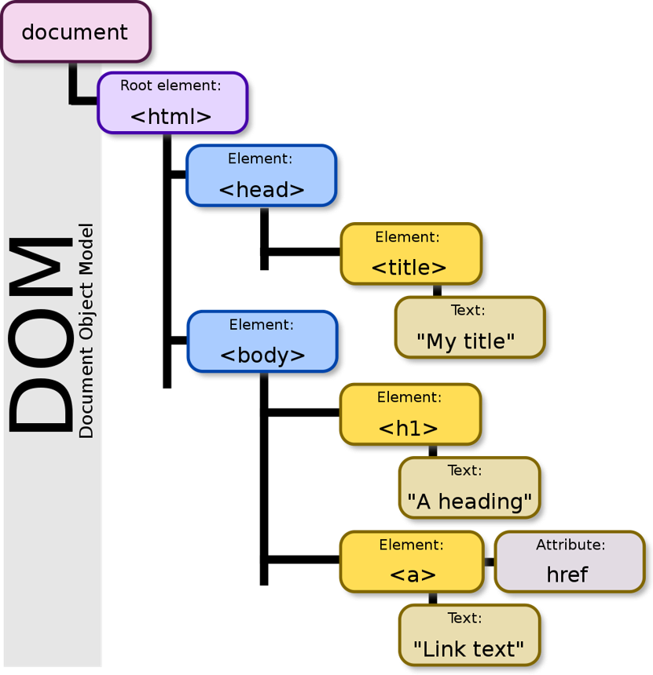
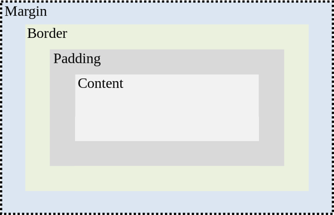
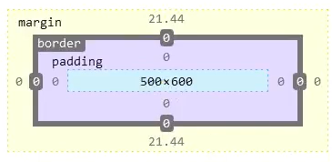
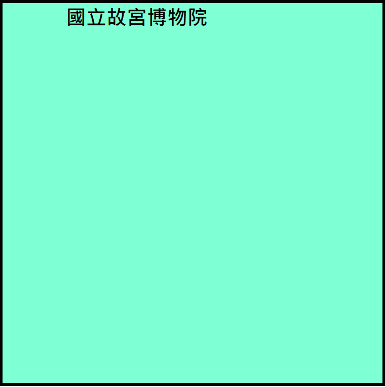
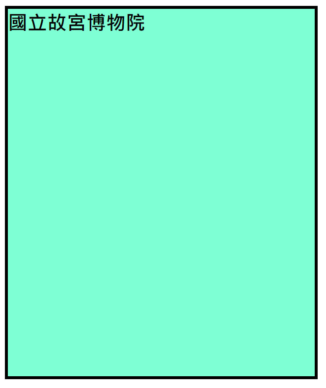
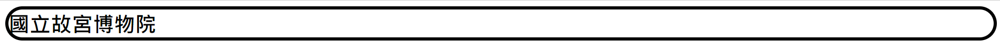
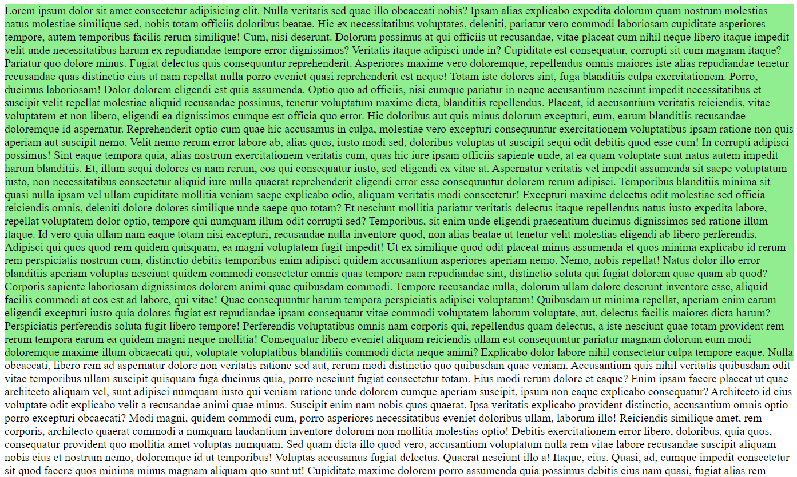
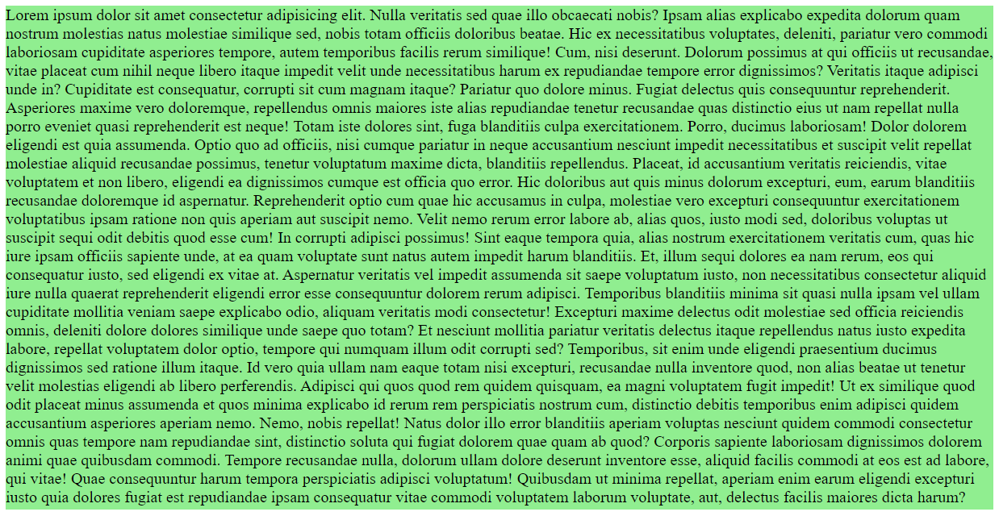
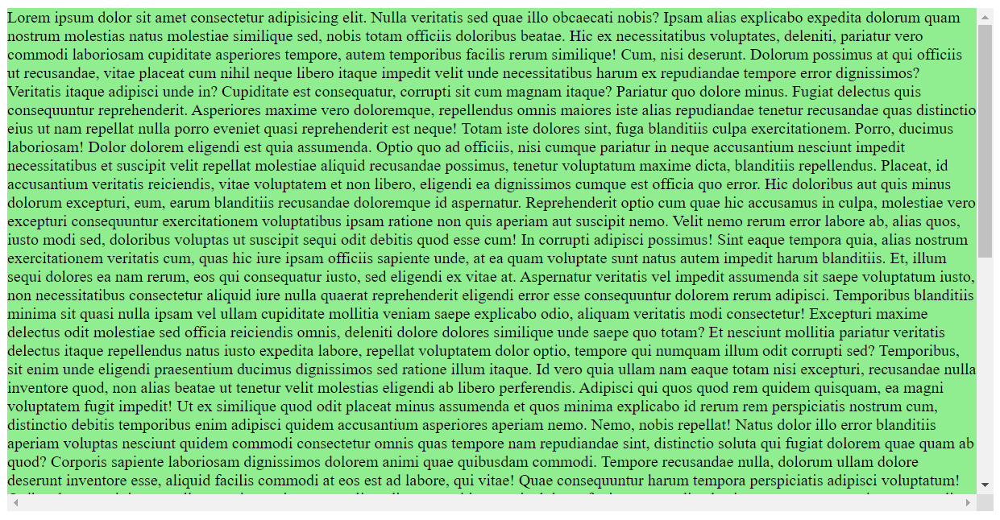

CSS -> 幫自己的 HTML 元素**新增樣式**的方法，有各種顏色、排版更符合美感

# DOM Tree

DOM Tree (文件物件模型 Document(HTML) Object(OOP) Model ) 是加載到瀏覽器中網頁的**樹狀表示**

在 DOM Tree 中，父節點 Parent Node 可被稱為 Child Node 的父元素 Parent Element 反之， Child Node 可稱為 Parent Node 的子元素 Child Element

瀏覽器加載網頁時，它會創建該頁面的 DOM Tree



# CSS 3

CSS (階層式樣式表 Cascading Style Sheet)被用來設定網頁的樣式及佈局

Ex:改變字體、顏色、尺寸以及擺放的內容、拆分為多欄，或是添加動畫效果和其它裝飾的特性

_注意！！我們沒有必要了解所有世界上存在的 CSS 屬性! 只要認識常用的以及實用的屬性即可_

[CSS mdn](https://developer.mozilla.org/en-US/docs/Web/CSS)

[CSS reference](https://developer.mozilla.org/en-US/docs/Web/CSS/Reference)

CSS comment 語法為 `/**/`

`練習`

最簡單的 CSS 寫法

```CSS
<head>
    <style>
      /* selector */
      h1 {
        color: red;
      }

      h2 {
        color: green;
      }
    </style>
</head>
```

# 樣式附加於 HTML

CSS 程式碼基本上可放置於三個地方：

- inline styling (把 HTML 寫在同一行) 優點是*優先層級最高*，但缺點是只能對**特定**的標籤設定樣

```CSS
<h1 style="color: red;">國立故宮博物院</h1>
```

- internal styling (把 HTML 文件跟 CSS 文件放在同一個文件當中，修改的內容僅限於當前文件) 優點是方便撰寫，缺點是若有多個 HTML 頁面，則難以維護程式碼

```CSS
<head>
    <style>
      /* selector */
      h1 {
        color: red;
      }

      h2 {
        color: green;
      }
    </style>
</head>
```

- external styling (CSS 寫一份文件，HTML 寫一份文件，讓 HTML 去連結到 CSS 頁面) 最常見的放置位置，其優點為容易維護

HTML 的 head 連結 CSS 文件

```HTML
<head>
<link rel="stylesheet" href="./style.css" />
</head>
```

CSS 文件內容

```CSS
selector
h1 {
  color: red;
}

h2 {
  color: green;
}
```

# 顏色設定

CSS 當中有下列幾種常見的顏色設定方式：

- Color Keywords (named color) ：這些為 CSS**預定保留**的關鍵字，例如 red, black, purple, green, 珊瑚色 coral 等等

[ndn named-color](https://developer.mozilla.org/en-US/docs/Web/CSS/named-color)

- rgb：依照光學三原色，分別設定**紅、綠、藍**三個色彩  
  數值範圍是 0 到 255，共 256 (2^8) 種不同選擇

  每個 color channel 使用 1 byte (=8bits)來儲存

  ```CSS
  h1 {
  color: rgb(255, 255, 0);
  }
  ```

- rgba：同 rgb，但使用多一個叫**alpha**的 channel 來儲存*透明度*  
  透明度範圍是 0 到 1

  ```CSS
  h1 {
  color: rgba(255, 255, 0, 0);
  }
  ```

- hex：使用**十六進制**的數字來代表顏色  
  十六進制數字的範圍是 0, 1, 2, …, 8, 9, A, B, C, …, F

  ```CSS
  h1 {
  color: #000000;
  }
  ```

- HSL：即色相、飽和度、亮度（Hue, Saturation, Lightness）  
  這種表示法試圖做到比基於笛卡爾坐標系的幾何結構 RGB 更加直觀

  ```CSS
  h1 {
  color: #cec2e0;
  }
  ```

HSL 與 hex 系統互換可由用 [系統互換](https://coloors86.netlify.app) 完成

# CSS Selectors 選擇器

選擇器 Selectors -> CSS 中去選擇哪些 HTML 的標籤是我們要選擇來套用樣式的

- 全部的選擇器 Universal Selector `*` 匹配*任何類型*的 HTML element

  ```CSS
  *{
  color: blue;
  }
  ```

- Element Selector 可選擇特定的 HTML element (tag)

  ```CSS
  h2 {
  color: green;
  }
  ```

- ID Selector 可選擇有特定 ID 屬性的 HTML element

  ID 只能設定特定標籤，**不可重複利用**

  Defines a **unique** identifier (ID) which must be unique in the whole document

  [mdn id](https://developer.mozilla.org/zh-CN/docs/Web/HTML/Global_attributes/id)

  ```CSS
  #first-paragraph {
  color: rgb(128, 64, 0);
  }
  ```

- Class Selector 可選擇所有有特定 class 屬性的 HTML element

  **class 可以重複利用，設定在不同標籤中**

  A space-separated list of the classes of the element

  ```CSS
  .blue-text {
  color: purple;
  }
  ```

  一個標籤可以有多個 class，在後面加空白鍵

  HTML 文件內容，同時給顏色、放大字體效果

  ```HTML
  <p class="blue-text large-text">
  ```

  CSS 文件內容，設定方式

  ```CSS
  .blue-text {
  color: purple;
  }

  .large-text{
    font-size: 32px; /*文字大小*/
  }
  ```

`element selector、class selector並用`

```CSS
a.large-text{  /* 選取<a> + . + class name */
  font-size: 32px;
}
```

- Grouping Selector 可**一次選擇數個** HTML 元素，並以*逗號*分隔

  ```CSS
  h1,
  h2,
  h3,
  h4,
  h5,
  h6{
    color: red;
  }
  ```

- 後裔 Descendant Selector 由兩個或多個用**空格分隔**的選擇器組成

  HTML 文件

  ```HTML
  <h2>相關頁面</h2>
  <div class="link1">
    <a href="https:www.google.com">Google首頁</a>
    <a href="https:www.youtube.com">YouTube首頁</a>
  </div>
  <div class="link2">
    <a href="https:www.yahoo.com">yahoo首頁</a>
  </div>
  ```

  CSS 文件

  ```CSS
  div.link1 a {
    color: red;
  }

  div.link2 a {
    color: green;
  }
  ```

- Attribute Selector 選擇**所有**具有**相同屬性**的 HTML 元素

  ```CSS
  input[type="text"] {
    color: red;
  }
  ```

- pseudo-class 用於指定所選**元素**的**特殊狀態**

class 單字的使用更多是指**具有共同特徵並通過種類或質量與其他事物區分開來的一組或類別的事物**，跟 Object-Oriented Programming 當中的 class 無關

例如：  
`:hover` 可用於在用戶滑鼠懸停在按鈕上時更改按鈕的樣式

```CSS
input[type="text"] {
  color: red;
}

/* 當滑鼠游標碰到要輸入的文字時，會變色 */
input[type="text"]:hover {
  color: lightgreen;
}

/* 當滑鼠點要輸入的文字時，會變色 */
input[type="text"]:active {
  color: lightgreen;
}

/* 在當前輸入欄上，文字會變色 */
input[type="text"]:focus {
  color: lightgreen;
}
```

`:nth-child()`可用來選擇第**n**個元素

- 不存在的元素 pseudo-element 是添加到選擇器的關鍵字，可讓我們設置所選元素的**特定部分**的樣式

例如：

`::before`

```CSS
p::before {
  content: ">>";
  color: blue;
}
```

目的在於創造一個 DOM 當中不存在的 HTML 元素。我們知道第一行並沒有被任何 tag 包住，但::first-line 選取的過程中，就像是用了一個看不到的 tag 把第一行包住，所以才能選到這行。

`::first-line` 可用於更改段落第一行的字體

```CSS
p::first-line {
  font-size: 32px;
}
```

`::selection` 更改選取時的底色

```CSS
*::selection {
  background-color: lightgreen;
}
```

# CSS 概念

## 繼承 Inheritance

### Parents and Children

在 HTML 當中的 DOM Tree 中，Parent Node 可被稱為 Child Node 的父元素 Parent Element，反之， Child Node 可稱為 Parent Node 的子元素 Child Element

### Inherited Properties and Non-Inherited Properties

CSS 當中的某些屬性會被子元素繼承，而某些不會

會繼承的屬性中，常見的包含 `color`, `font-family`, `font-size`, `font-weight`, `list-style-type`, `text-align`

[詳細清單](https://www.w3.org/TR/CSS21/propidx.html)

然而，因為 user agent styling 優先度比 inheritance 更高，所以要注意瀏覽器的預設樣式**可能會覆蓋**繼承的屬性。例如，`<a>`標籤的顏色通常需要額外設定

user agent styling -> 指 brower default ，瀏覽器給的預設樣式

## 有衝突的 Conflicting Styling

- 由於一個 HTML 文件可以連結到數個 CSS Stylesheet，且單一 Stylesheet 內部可能出現重複設定樣式的情況，所以 CSS 程式碼之間可能存在衝突

```CSS
h1{
  color: green;
}

p{
  color: red;
}

h1{
  color: blue;
}

/*
-> 下面的藍色會覆蓋上面的綠色
這就是階層式樣式 cascading style sheet
*/
```

- 衝突處理原則有 優先度 `Priority`, 特定度 `Specificity`, 以及 順序規則 `Order Rule`

  W3C 的標準，網頁瀏覽器的預設樣式被稱為 user agent stylesheet，而網頁瀏覽器連結的 stylesheet 被稱為 user stylesheet

### 優先度 `Priority`

1. Inline Styling

2. User Stylesheet (內部順序由 Specificity 決定)

3. User Agent Stylesheet

4. Inheritance

### 特定度 `Specificity`

CSS 選擇器有不同的 specificities

選擇 id 比選擇 class 更 specific，所以當一個標籤有兩個具體程度不同的 CSS 選擇器時，它會取**更 specific**的樣式並套用於標籤上面，而不考慮順序前後

1. id - specificity (1, 0, 0)

2. class - specificity (0, 1, 0)

3. tag - specificity (0, 0, 1)

### 順序規則 `Order Rule`

順序規則是指：

1. 當我們有相同 specificity 的選擇器時，後寫的選擇器樣式會覆寫前面寫的樣式

2. 放在比較後面的`<link>` stylesheet 會覆寫放在前面的`<link>` stylesheet

# 單位

## 絕對單位 absolute units

指有預設數值或是現實生活定義的單位，包含 像素 `px`（代表 pixel，長度為 2.54 cm (1 inch) 的 1/96）, `in`, `mm`, `cm`等等

<font color="red">預設瀏覽器的字體大小是 16 px</font>

[element 預設值](https://www.w3schools.com/cssref/css_default_values.php)

```CSS
h1{
  font-size: 20px;
}
```

## 相對單位 relative units

指相對於某種數值的單位，包含：

1. `em` – 相對於**parent element**的長度  
   在多層的 DOM Tree 當中，越下層的 element 的 em 值可能難以計算

```CSS
body{
font-size: 50px;
}

h1{
  font-size: 1em;
}
/*
相對 body 的字體大小
1em = 50px (body * 1)
2em = 100px (body * 2)
*/
```

2. `rem` – root em 的意思  
   rem 會找到`<html>`這個元素的設定  
   網頁瀏覽器的預設 font size 為 16px，所以 1rem 等於 16px

如果年長使用者的網頁瀏覽器設定字體放大，則網頁瀏覽器的預設 font size 可能為 24px，則 1rem 等於 24px

```CSS
h1 {
  font-size: 3rem;
}
```

3. `vw` – viewport width 的縮寫，是指目前 viewport (也就是瀏覽器視窗)的**寬度**的 1/100

100vw 長度通常會略寬於網頁寬度，所以設定某個元素的寬度為 100vw 會導致出現*下方水平移動軸 horizontal scrollbar*，因此<font color="red">通常不會設定 100vw</font>

```CSS
h1{
  background-color: red;
  width: 100vw;
}
```

4. `vh` - viewport height 的縮寫指目前 viewport (也就是瀏覽器視窗)的**高度**的 1/100

```CSS
h1{
  background-color: red;
  height: 100vh;
}
```

`vw`、`vh` 的好處就是用手機、平板、電腦，都可以依照瀏覽的尺寸彈性更動

5. `%` - percentage 代表相對於**parent element**的值

例如，parent element 的 width 是 500px，在 child element 設定 width 為 50%，則 child element 寬度就是 250px

```CSS
.box {
  width: 500px;
  background-color: red;
  height: 300px;
}

.inner-box {
  width: 50%;
  background-color: black;
  height: 50%;
}
```

# 文字樣式 text styling

- font-size - 設置字體的大小，可以設置*絕對單位*或是*相對單位*

- text-align – 設置 block element 或 table cell 中的 content 的水平**對齊**位置

  `<a href>` 不會有反應是因為他是 inline element

  `block element`

  ```CSS
  h1{
   text-align: center;
  }
  ```

  `table cell`

  ```CSS
  table, th, tr, td {
    border: 1px solid black;
  }

  td, th {
   text-align: center;
  }
  ```

- text-decoration - 設置文本上裝飾線的外觀

  ```CSS
  a {
    text-decoration: none;
  }

  a{
    text-decoration: line-through; /* 劃掉 */
  }
  ```

- line-height - 通常用於設置文字行距

  ```CSS
  p{
    line-height: 50px;
  }
  ```

- letter-spacing - 設置文字水平間距

  ```CSS
  p {
    letter-spacing: 10px;
  }
  ```

- font-family - 為所選元素指定一個或多個 **字體** 系列的優先列表

  ```CSS
  body{
    font-family: 'Times New Roman', Courier, monospace;
    /* Times New Roman 找不到就用 Courier ，在找不到就用 monospace*/
  }
  ```

  [google fonts](https://fonts.google.com/)

  _使用方法_

  先將 link 放 HTML 檔案，再放`CSS rules to specify families`到 CSS 裡面

  ```CSS
  body{
    font-family: 'Noto Sans TC', sans-serif;
  }
  ```

- text-indent - 設段落的內縮長度

  要內縮 2 個字就是 32px ， 1rem = 16px

  ```CSS
  p{
    text-indent: 2rem;
  }
  ```

- font-weight – 設定**粗體字**

  bold 粗體，bolder 加粗體

  ```CSS
  h1{
    font-weight: normal;
  }
  ```

# 背景樣式

- background-color - 用來設定 HTML**元素的背景顏色**，值可以是顏色亦可以是特定關鍵字，例如 transparent

  ```CSS
  /* 顏色 */
  h1 {
    background-color: rgba(200, 200, 200, 0.5);
  }

  /* 關鍵字 */
  h1 {
    background-color: transparent;
  }
  ```

- background-image - 在元素上設置一個或多個背景**圖像**

  ```CSS
  body {
    background-image: url("./故宮圖片2.jpeg");
  }
  ```

- background-size - 設置元素**背景**圖像的**大小**

  [background size](https://developer.mozilla.org/en-US/docs/Web/CSS/background-size)

  圖像可以保留其自然大小、拉伸或限制以適應可用空間

  設定`contain`，則會在其容器內盡可能大地 **等比例縮放** 圖像，而不裁剪或拉伸圖像。 如果容器大於圖像，這將導致圖像*重複平鋪*，除非 background-repeat 屬性設置為 `no-repeat`

  ```CSS
  body {
    background-image: url("./故宮圖片2.jpeg");
    background-size: contain;
    background-repeat: no-repeat;
  }
  ```

  設定`cover`，則會將圖像（同時保持其比例）縮放到盡可能小的尺寸以填充容器（即：其高度和寬度都完全覆蓋容器），不留空白。 如果背景的比例與元素不同，則圖像將被垂直或水平*裁剪*

  ```CSS
  body {
    background-image: url("./故宮圖片2.jpeg");
    background-size: cover;
  }
  ```

- background-position - 設置每個背景圖像的**\*初始位置**。 center 使圖像居中。也可設定 top, left, bottom, right

  ```CSS
  body {
    background-position: bottom;
  }
  ```

- background –背景各種設定的 快捷 shorthand 設定，可一次設置所有背景樣式屬性，例如顏色、圖像、原點和大小，或重複方法

  [background mdn](https://developer.mozilla.org/en-US/docs/Web/CSS/background)

  例如  
  background: green; 可代表 background-color: green;  
  background: url(“test.jpg”); 可代表 background-image : url(“test.jpg”);

# Box Model

CSS Box Model 是指，每個 block element 都被視為一個 box，並且 box 由`margin`, 邊界 `border`, content 跟邊界的距離 `padding`以及`content`所組成

inline element 僅使用 Box Model 中定義的一部分屬性



padding、 border 以及 margin 都可再分別設定上下左右的個別屬性

- content：顯示內容的區域； 使用 `width` 和 `height` 等屬性調整大小

  ```CSS
  h1 {
    width: 500px;
    height: 600px;
    background-color: aquamarine;
  }
  ```

  21.44 是 h1 的預設，`margin-top: 0.67em`，`margin-bottom: 0.67em`

  

- padding：位於 content 周圍的區域，在 content 與 border 之間； 可使用 `padding` 屬性調整大小

  [padding mdn](https://developer.mozilla.org/en-US/docs/Web/CSS/padding)

  ```CSS
  h1 {
    padding-left: 100px;
  }
  ```

  

  padding 的 shorthand property

  - Apply to all four sides
    ```CSS
    padding: 1em;
    ```
  - top and bottom | left and right
    ```CSS
    padding: 5% 10%;
    ```
  - top | right | bottom | left
    ```CSS
    padding: 5px 1em 0 2em;
    ```

- border： 包住 content 與 padding 的邊框； 可使用 `border` 屬性調整大小

  [border mdn](https://developer.mozilla.org/en-US/docs/Web/CSS/border)

  ```CSS
  h1 {
    border: 5px solid black;
  }
  ```

  

  border 可特別設定 外框圓滑度(半徑)`border-radius` 屬性

  ```CSS
  h1 {
    border-radius: 30px;
  }
  ```

  

- margin：border 外的區域；可用 `margin` 屬性調整大小

  ```CSS
  h1 {
    border: 5px solid black;
    margin: 0rem 3rem;
  }
  ```

## 屬性說明

### width

指定元素的寬度。_預設情況下，該屬性定義內容 content 的寬度_

在 CSS 中，`width`可以直接設定 %

對於 block element 來說，因為寬度的值與 content 無關，而是跟 parent element 一樣寬，往上追溯直到`<html>`，而瀏覽器在計算有效寬度時會考慮瀏覽器窗口的打開寬度。因此，若我們設定 block element 的 `width: 50%`是可行的，會讓 block element 的寬度變成其 parent element 的一半

但是，如果 box-sizing 設置為 border-box，它會被設定為 border 區域的寬度

## height

指定元素的高度。_預設情況下，該屬性定義 content 區域的高度_

在 CSS 中，`height`**不行**直接設定 %

block element 的 `height` 取決於其 content。但瀏覽器根本就不計算內容的高度，所有的 element 的高度都是 auto

當我們要求瀏覽器根據這樣一個預設值來計算百分比高度時，只能得到 `undefined` 的結果

因此，直接設定 block element 的 `height: 50%`並不能改變其高度，除非我們先設定`<html>`,`<body>`的高度是 100%

如果要使用 % 來設定高度，必須先設定 parent element 高度為某特定值，這樣才算得出來，例如， parent element 高度為 `1000px`、`30vh` 等等

```CSS
body {
  height: 1000px;
}
div.box {
  width: 50%;
  height: 50%;
  padding: 10px;
  border: 10px solid black;
  background-color: green;
}
```

但是，如果 box-sizing 設置為 border-box，它會被設定為 border 區域的高度

## 溢出 overflow

在絕大數的情況，我們不會去設定某個元素的高度，所以若有設定高度，則須考慮**溢出 overflow**的情況

當元素的寬度或高度小於 content 時，我們可以設定 overflow 屬性來選擇處理方式：

- `visible`(預設) - content 不會被修剪，可以呈現在元素框之外

  

- `hidden` - 如果需要，內容將被剪裁以適合元素。不提供滾動條

  

- `scroll` - 如有必要，內容將被剪裁以適合填充框。 瀏覽器顯示移動軸

  

若想要指設定特定方向的 overflow 屬性，可只選擇 水平方向 `overflow-x`或 垂直方向 `overflow-y`
